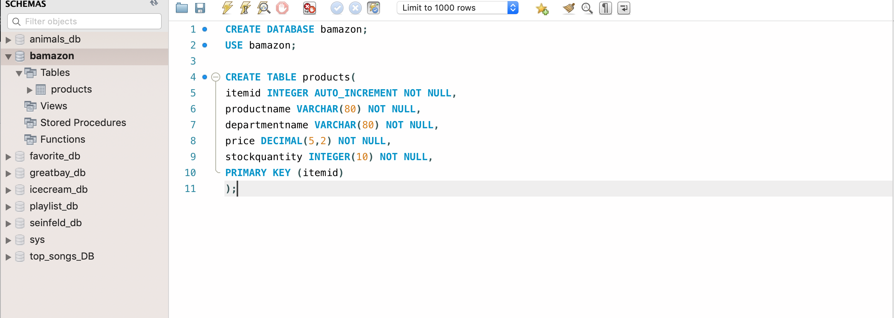
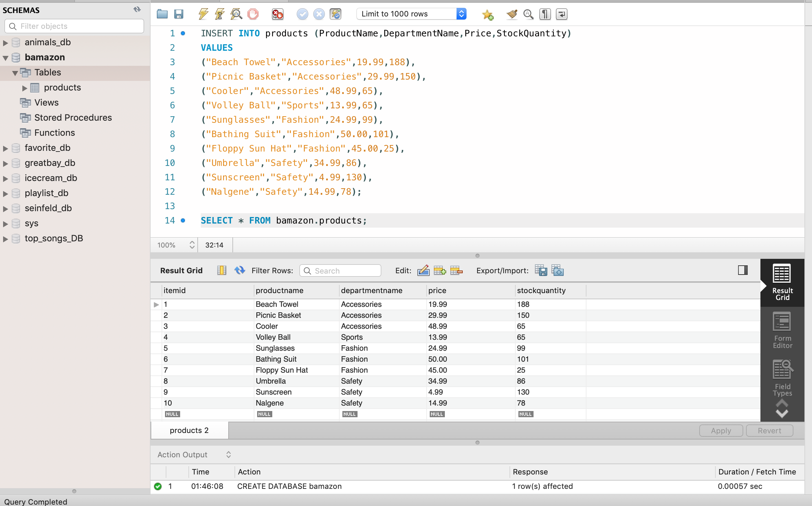
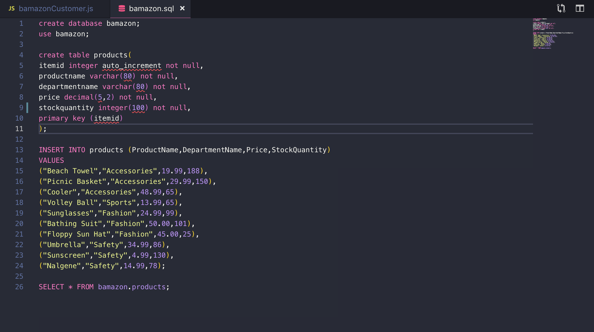
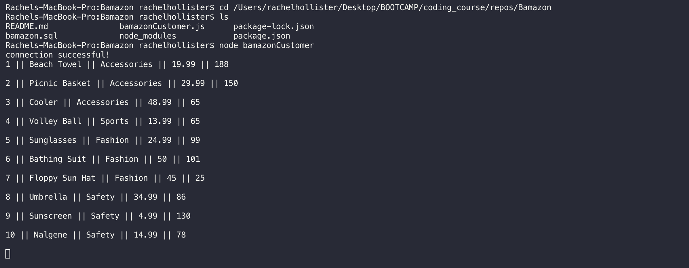

Welcome to Bamazon, a store front similar to Amazon. In my Bamazon a customer visits and is prompted to select items from a list they would like to purchase. A customer will take orders and it will deplete the store quantity on hand through a database created in MySQL. The steps in creating this node application are as follows.

1. Created a MySQL Database called `bamazon`.

2. Made Table inside of that database called `products`.

3. Products table should have each of the following columns:
  * item_id (unique id for each product)
  * product_name (Name of product)
  * department_name
  * price (cost to customer)
  * stock_quantity (how much of the product is available in stores)
  *Populated this database with around 10 different products. (i.e. Insert "mock" data rows into this database and table).
 

4. Then create a Node application called `bamazonCustomer.js`. Running this application will first display all of the items available for sale. Include the ids, names, and prices of products for sale.
 

***Please note as of now I am still working on this part of the application. Need to review errors I was logging once I started with step fice. Will confirm updates internally and reach out with questions!

5. The app prompts the user with two messages.
   * The first should asking them the ID of the product they are buying.
   * The second message asks how many units of the product they would like to buy.

6. Once the customer has placed the order, my Bamazon checks if there is enough product in stock to meet the customer needs.
* If not, the app should log a phrase like `Insufficient quantity!`, and then prevent the order from going through.

7. If my Bamazon store has enough to fulfull the order then the following occurs;
   * The SQL database updates to reflect the remaining quantity of products in store.
   * When the update goes through, the customer will see the total cost of their purchase.
